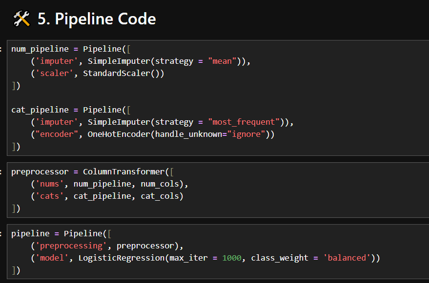
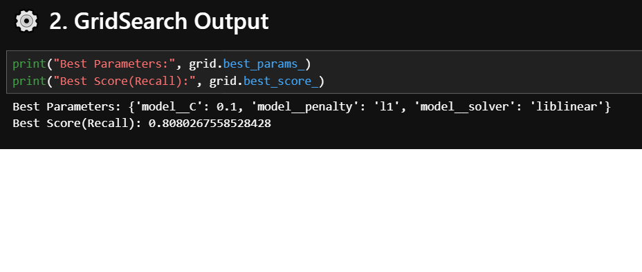
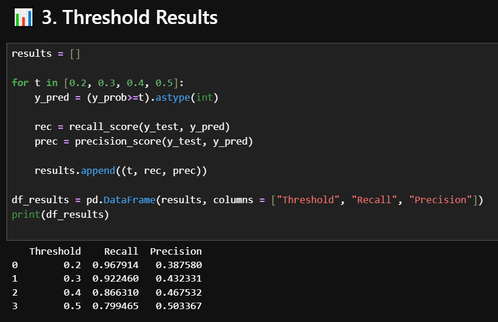
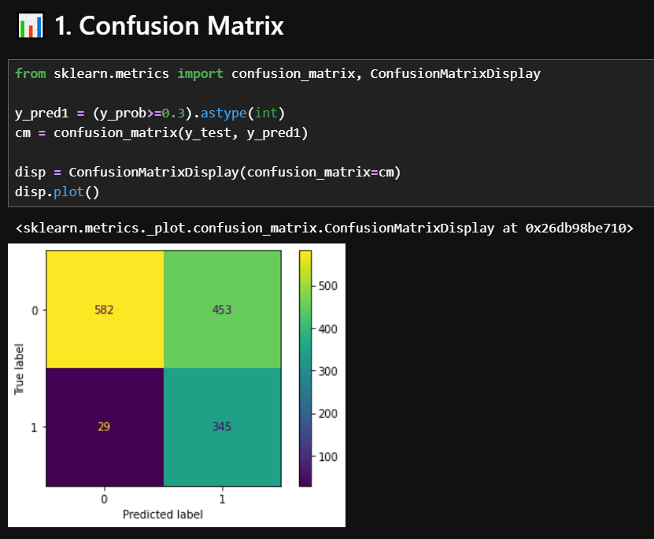
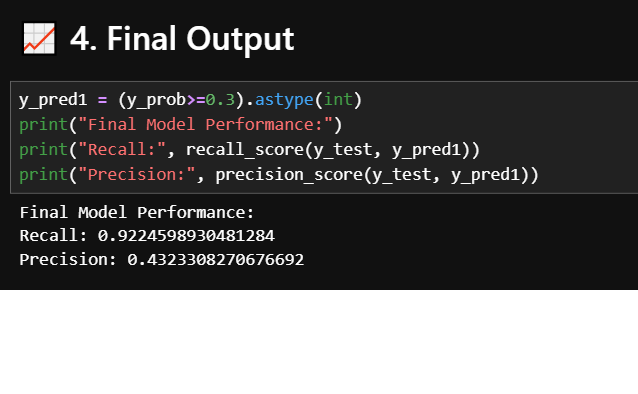

# Telecom-Customer-Churn-Advanced-Version
End-to-end ML project using Pipeline, GridSearchCV, and Threshold Tuning

## 🚀 Project Overview

This project predicts whether a customer will churn using Machine Learning.
It includes end-to-end pipeline building, model optimization, and business-focused decision making.

---

## 🧠 Key Features

* Data preprocessing using Pipeline
* Handling missing values, encoding, and scaling
* Feature selection using L1 Regularization
* Hyperparameter tuning using GridSearchCV
* Model evaluation using Recall & Precision
* Threshold tuning based on business requirement

---

## ⚙️ Tech Stack

* Python
* Pandas
* Scikit-learn

---

## 📈 Model Performance

| Metric    | Value |
| --------- | ----- |
| Recall    | ~0.92 |
| Precision | ~0.43 |
| Threshold | 0.3   |

---

## 🎯 Business Insight

Recall was prioritized to reduce customer churn.
Threshold tuning helped achieve better business outcomes.

---

## 📸 Screenshots

---

## 💡 Conclusion

This project demonstrates how to build a production-level ML system using pipelines, tuning, and business logic.

---
